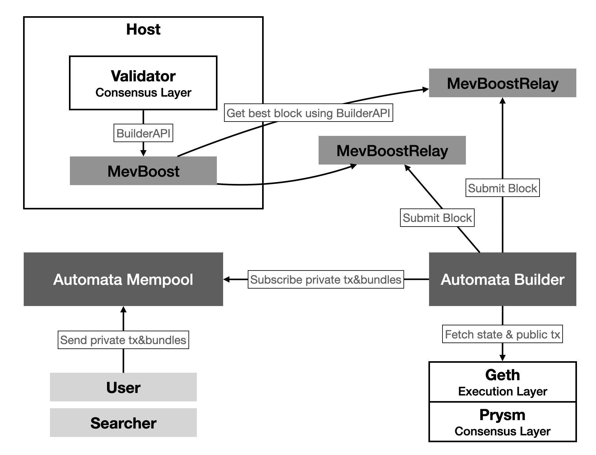

# TEE-builder

**WARNING: This is not for production use. There are debug and info logs that leaks information within the enclave.**

## Overview

This system's architecture is comprised of two main components: mempool and builder. They are decoupled and can operate as independent services, allowing the mempool to serve multiple builders, and likewise, builders to connect to multiple mempools.

These components all run within the protected environment of SGX and utilize remote attestation technology to verify if they are operating within an enclave, thereby ensuring the security of communication. Upon initial communication, they will exchange internally generated random keys, and all subsequent communication data will be transmitted through symmetric encryption.

Within this architectural framework, the mempool is responsible for receiving users' private transactions or bundles, and pushing them to the builder for processing. The builder, on the other hand, collects transactions or bundles from various channels such as mempool and geth public mempool, achieving centralized processing and collaborative work of transactions.
